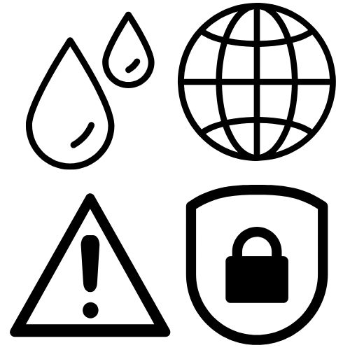

# Summary

.pull-left[

In orbit since __March 7th, 2017__ 

Launched by the European Space Agency as part of the __Copernicus Programme__

Now __one of three Sentinel-2 satellites__:
- Sentinel-2A
- Sentinel-2B
- Sentinel-2C

Quick stats:
- 13 spectral bands
- 10m spatial resolution for VNIR bands
- 10-day cycle

]

.pull-right[

Source: <a href=" https://esoc.esa.int/sites/default/files/Sentinel-2_pillars%20916x700.jpg " target="_blank">European Space Agency</a>

]

---

# Applications

.pull-left[

The European Space Agency specifies a __range of applications__ for Sentinel-2B:
- Marine environment monitoring  
- Land environmental monitoring
- Emergency management service 
- Security 
  - Border surveillance
  - Maritime
  - External action
  
Sentinel's versatility is thanks to its relatively high spatial, spectral and temporal resolutions. 
  
Such a variety of functions opens up __many avenues for research__ using Sentinel-2B.

]

.pull-right[

Source: Canva

]
 
---

# Application Example

*War Related Building Damage Assessment in Kyiv, Ukraine, Using Sentinel-1 Radar and Sentinel-2 Optical Images* `r Citep(myBib,"aimaitiWarRelatedBuilding2022")`

Overview:
- Examines the performance of Sentinel-1 and Sentinel-2 data for assessing building damage in Kyiv.
- Employs __SAR log ratio of intensity analysis__ using Sentinel-1 and __texture analysis__ using Sentinel-2.
  - SAR: Compares microwave backscattering at two time periods to detect change.
  - Texture analysis: Compares the spatial variation and intensity of neighboring pixels.
- Detected building damage using Sentinel showed a good match with reference to WorldView imagery.

Thoughts:
- Highlights the opportunity to use different sensors for different types of analysis.
- Confirms the applicability of Sentinel-2B imagery for assessing damage from man-made or environmental crises, and the potential for guiding efficient allocation resources.

---

# Reflection

Sentinel-2B is currently one of the highest-resolution Earth observation imagery sources that is freely available to the public. There are many benefits to using Sentinel-2B imagery, but there are also important considerations. 

.pull-left[

Advantages:
- Facilitates research and promotes the democratization of data. 
- Supports an incredible range of applications across many disciplines.

Concerns:
- Increasing public accessibility to high-resolution imagery raises questions around privacy and data usage.
  - Who is using the data and for what purposes?

]

.pull-right[

     

Source: <a href=" https://www.dictionary.com/e/emoji/thinking-face-emoji" target="_blank">Dictionary.com</a>

]

---

# References

Aimaiti, Y. et al. (2022) ‘War Related Building Damage Assessment in Kyiv, Ukraine, Using Sentinel-1 Radar and Sentinel-2 Optical Images’, Remote Sensing, 14(24), p. 6239. Available at: https://doi.org/10.3390/rs14246239.

European Space Agency (2025) Sentinel-2, SentiWiki. Available at: https://sentiwiki.copernicus.eu/web/sentinel-2 (Accessed: 22 January 2025).

---
class: center, middle, inverse

## Thank you!
